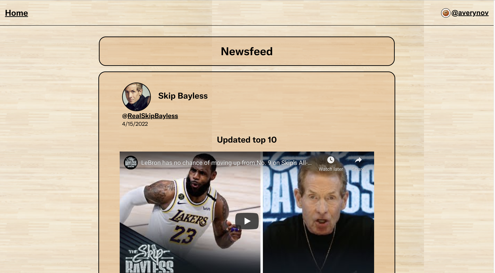

# NBA Hot Takes

## A social media dedicated to NBA Hot takes

## Date: 07/28/2022

#### By: Avery Novick

####  

<!-- [Deployed Website](https://novick-nba-app.herokuapp.com/) -->

<a href="https://novick-nba-app.herokuapp.com/" target="_blank" rel="noreferrer">Deployed Website</a>

---

---

### _Description_

For my second project with General Assembly I was tasked to make a full stack MERN application. As an avid NBA fan who can't stop checking twitter, I decided to make a social media app focused around the NBA.

---

### Project Overview

Once a user opens up the page they will be asked to enter a username. From there, the user will be taken to the home screen where they can view and interact with user generated posts. Clicking on your username in the top right corner will allow you to view your profile and make a post.

---

### Getting Started

Make a [twitter developer account](https://developer.twitter.com/en/portal/dashboard). Then create a project and save all the relevant info.

Once you fork and clone the repo:

    1.   run npm i in the main directory
    2.   cd into client and run npm i
    3.   cd into client and run npm i
    4.   create a .env file in the main directory and assign your Bearer token to 'BEARER_TOKEN='
    5.   in the main directory run seed/node/userPostsComments.js
    6.   in client run npm start
    7.   in main directory run npm run dev

#### _Deployed Login Page_

#### _Deployed Homepage_

#### _Deployed Profile page_

#### _Deployed Profile page_

---

### _Technologies Used_

- React.js
- MongoDB
- Mongoose/Express
- Javascript
- Node.js
- CSS
- HTML
- Twitter v2 api
- Heroku
- Atlas

---

#### _Future Updates_

- [x] Implement twitter API
- [x] Create a post feature
- [ ] Ask for user's twitter username to generate their tweets
- [ ] add picutres to posts
- [ ] allow users to dm each other

---

#### **_Resources_**

- Twitter v2 api
- Heroku
- Postman
